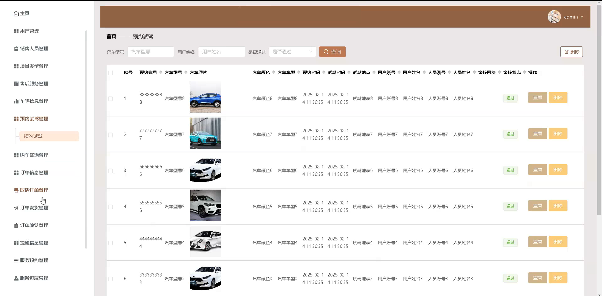

# springbootA434D
springbootA434D汽车销售系统
 
## 查看主页获取源码

### 一、关键词
车辆信息管理、预约试驾管理、购车咨询管理

### 二、作品包含
源码+数据库+全套环境和工具资源+本地部署教程

### 三、项目技术
前端技术：Html、Css、Js、Vue2.0、Element-ui 
后端技术：Java、SpringBoot2.0、MyBatis

### 四、运行环境（以下版本亲测，其他版本未知，请自测）
开发工具：IDEA/eclipse  + VSCODE

数据库：MySQL5.7（最低要5.7版本）

数据库管理工具：Navicat10以上版本

环境配置软件： JDK1.8 + Maven3.6.3

前端Nodejs：14

浏览器：谷歌浏览器

### 五、项目介绍
项目编号：springbootA434D

汽车销售系统主要用于整合汽车资源、提升销售效率与客户服务质量。

角色：管理员、用户、销售人员

用户功能：首页、售后服务、车辆信息、系统公告、个人中心、修改密码、预约试驾、购车咨询、订单信息、取消订单、订单发货、订单确认、提醒信息、服务预约、服务进度、我的收藏。

管理员功能：主页、用户管理、销售人员管理、项目类型管理、售后服务管理、车辆信息管理、预约试驾管理、购车咨询管理、订单信息管理、取消订单管理、订单发货管理、订单确认管理、提醒信息管理、服务预约管理、服务进度管理、系统管理、个人中心。

销售人员功能：主页、车辆信息管理、预约试驾管理、购车咨询管理、订单信息管理、取消订单管理、订单发货管理、订单确认管理、提醒信息管理、服务预约管理、服务进度管理、个人中心。

### 六、运行截图

